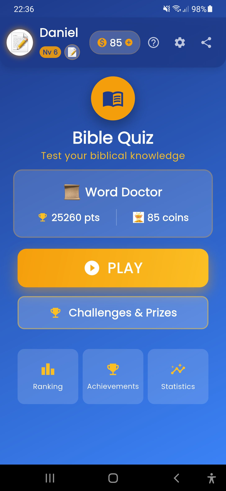
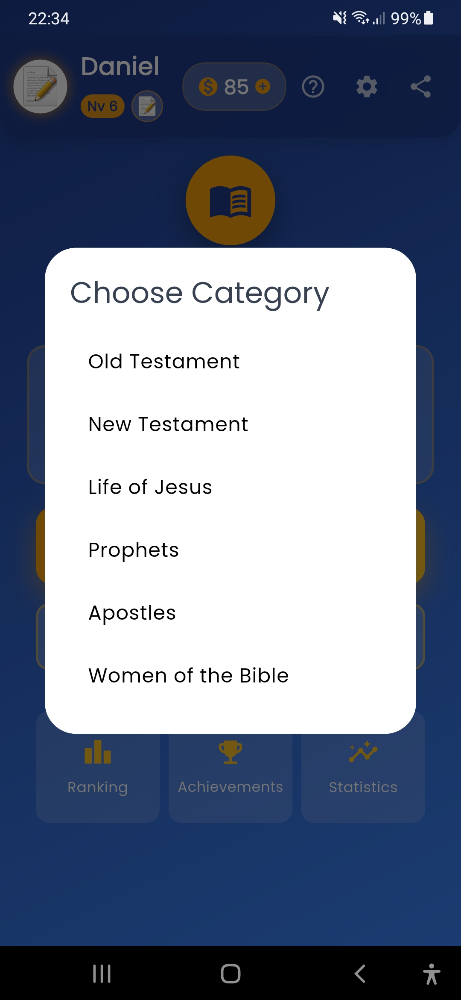
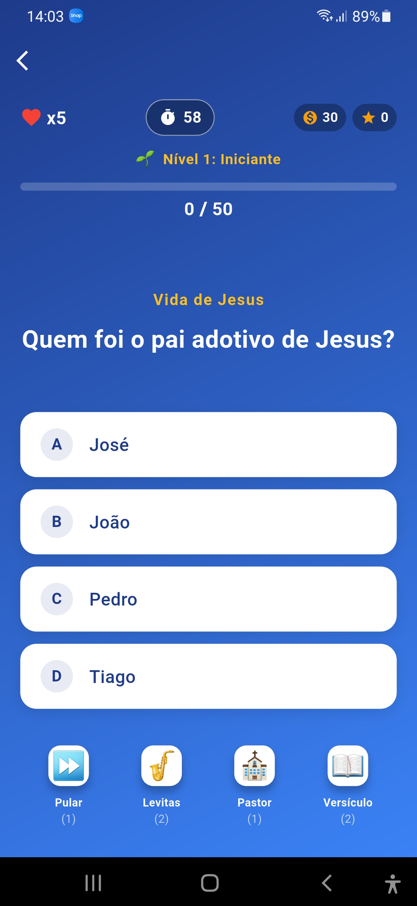
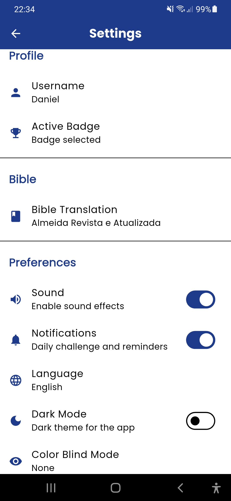

<h1 align="center">
   
  
   
  Bible Quiz App
   
</h1>

<h4 align="center">An interactive Bible trivia application built with Flutter.</h4>

  <a href="#about-the-project">About</a> •
  <a href="#features">Features</a> •
  <a href="#technologies">Technologies</a> •
  <a href="#architecture">Architecture</a>

---

## Get it on Google Play

> **Note:** The source code for this project is private. To experience the app, please download it directly from the Google Play Store using the link above!

## Screenshots

| Home | Categories | Gameplay | Settings | App Icon |
|:---:|:---:|:---:|:---:|:---:|
|  |  |  |  |  |

## About the Project

The **Bible Quiz App** is a mobile application developed to test and expand users' biblical knowledge in a dynamic, interactive, and fun way. Featuring a clean and user-friendly interface, the app offers multiple levels of varied questions, a scoring system, immersive sound feedback, and an in-app economy/reward system.

This showcase represents the complete lifecycle of a software product I developed: from ideation, UI/UX design, state architecture with Flutter and Provider, solving complex native build issues (NDK, Android permissions), to optimized packaging using **Android App Bundle (AAB)** and finally, successful submission, approval, and publication on the **Google Play Store**.

## Features

- **Multiple Difficulty Levels:** Tracks user progression through biblical knowledge.
- **Elegant State Management:** Seamless navigation ensured by the `provider` package under the hood.
- **Interactive Tutorial (Coach Mark):** Visual guides (tooltips) for perfect onboarding of new users.
- **Audio & Visual Feedback:** Smooth animations and immersive sound effects.
- **Store & In-App Purchases (IAP) System:** Real integration of in-app purchases for items and enhancements.
- **Scheduled Local Notifications:** Reminders to maintain retention and daily user discipline.
- **Social Sharing:** Support for users to share and challenge friends via WhatsApp and other networks.
- **Secure Offline Support:** Fast and efficient saving of history and scores directly on the device.

## Technologies & Clean Code

The following tools, libraries, and best practices form the foundation of this application:

- **[Flutter](https://flutter.dev/) & [Dart](https://dart.dev/)** - The core framework.
- **Provider** - Dependency injection and reactive state control pattern.
- **Shared Preferences** - Efficient storage of progress and settings.
- **AudioPlayers** - Audio playback engine.
- **Flutter Local Notifications** - Alarm and local push notification management.
- **In-App Purchase** - Integration with Google Play billing API.
- **Share Plus** - Integrations for "Share" call-to-action features.

## Architecture Overview

The internal structure adopts an architecture inspired by clean concepts, aiming to separate business rules from presentation:

- **Screens** - Complete UI interfaces composing app routes (Home, Levels, Matches).
- **Providers** - Concentrates business rules and manipulates data to pass down and rebuild screens.
- **Models** - Entities and OOP modeling (Questions, Alternatives, Answers).
- **Widgets** - Smaller visual blocks, componentized and reusable across various screens.
- **Services** - Low-level direct integrations and plugins (e.g., Local Notifications, IAP).

---

Developed, designed, and published with dedication by [Daniel Maia](https://www.linkedin.com/in/daniel-maia-3584963a/).
